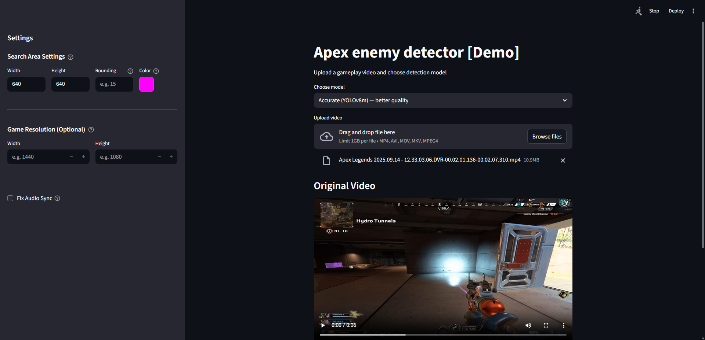
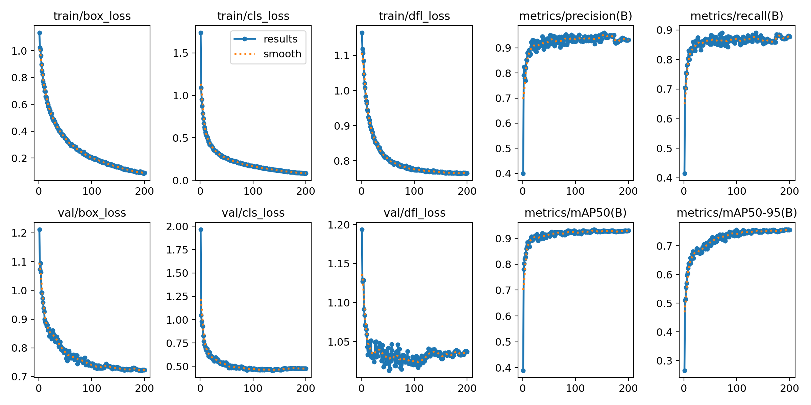
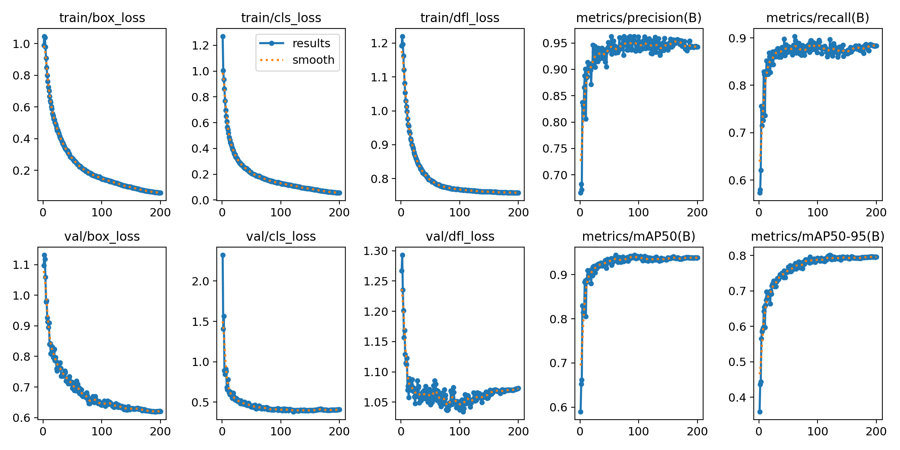
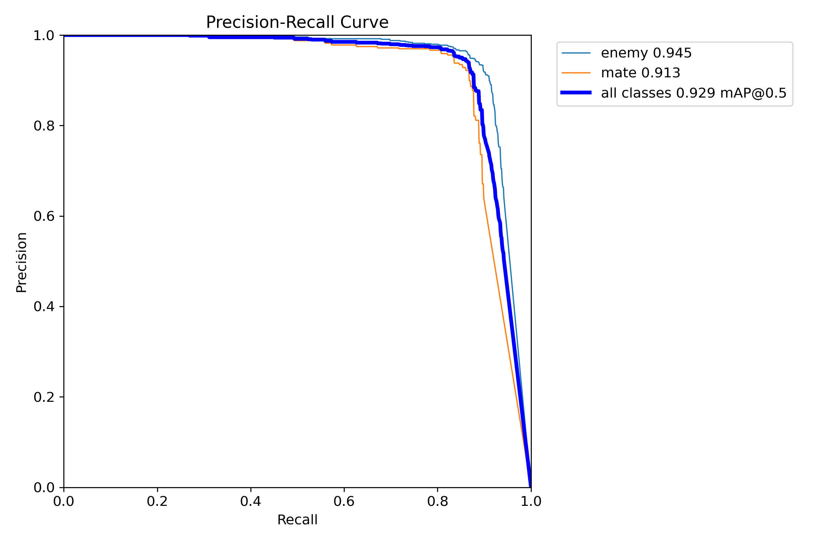
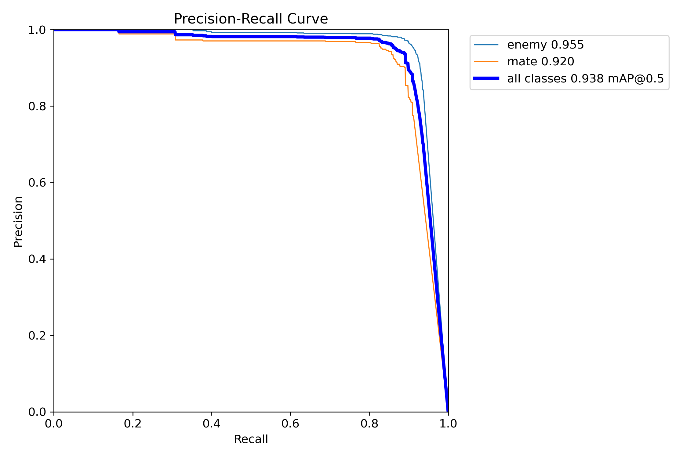

# Apex Legends Enemy Detector

AI-powered tool to analyze gameplay videos, detect enemies using YOLOv8, and fix stretched resolution issues.


> Final project for the [Deep Learning School course](https://stepik.org/250969) on Stepik.


---

> **Disclaimer:** This project is a purely educational tool built as a final assignment for a Deep Learning course. It processes **pre-recorded video files** and has no interaction with the game process, memory, or network. It cannot be used as a real-time cheat or aimbot. It does not violate any game's anti-cheat systems. The goal is to demonstrate object detection techniques using YOLOv8, not to gain any in-game advantage.

---

## Settings Interface



---

## Features

- **Smart Detection:** Center-focused search area for better performance.
- **Stretched Res Support:** Corrects stretched video to 1:1 proportions for accurate AI inference.
- **Audio Sync Fix:** Handles variable FPS and missing frames to keep audio in sync.
- **Task Queue:** Asynchronous processing using FastAPI and Worker.

## Models

Two custom YOLOv8 models are included, both fine-tuned from Ultralytics COCO pretrained weights on a custom Apex Legends enemy dataset.

### Training Setup

| Parameter | Value |
|---|---|
| Dataset | `apex_detect_v2_p1_converted` |
| Epochs | 200 (patience 100) |
| Batch size | 16 |
| Image size | 640×640 |
| Optimizer | AdamW (lr=0.001) |
| Augmentations | HSV (S/V ±0.3), horizontal flip (p=0.5), random erasing (p=0.4) |

### Model Comparison

| | **YOLOv8n (nano)** | **YOLOv8m (medium)** |
|---|---|---|
| File | `apex_detect_v8n_v2.1.pt` | `apex_detect_v8m_v2.1.pt` |
| Parameters | ~3.2M | ~25.9M |
| Precision | 0.932 | 0.943 |
| Recall | 0.877 | 0.883 |
| mAP@50 | 0.930 | 0.938 |
| mAP@50-95 | 0.756 | 0.796 |
| Training time | ~5.0 h | ~5.8 h |
| Better for | Speed / low-end GPU | Accuracy |

> Metrics are from the final epoch (200) on the validation set.

### Training Curves

<table>
<tr><th>YOLOv8n (nano)</th><th>YOLOv8m (medium)</th></tr>
<tr>
<td></td>
<td></td>
</tr>
</table>

### Precision-Recall Curves

<table>
<tr><th>YOLOv8n (nano)</th><th>YOLOv8m (medium)</th></tr>
<tr>
<td></td>
<td></td>
</tr>
</table>

---

## Requirements

- **GPU with CUDA support** — required for real-time inference (NVIDIA recommended)
- **CUDA 12.8** (or adjust the torch install URL for your version)
- **Python 3.10+**
- **ffmpeg** installed and available in `PATH`

---

## 🛠️ Installation

### 1. Clone the repo:
```bash
git clone https://github.com/PSImera/apex_enemy_detect_demo.git
cd apex_enemy_detect_demo
```

### 2. Create and activate virtual environment

```bash
python -m venv .venv
```

**Linux / macOS:**
```bash
source .venv/Scripts/activate
```

**Windows (cmd):**
```cmd
.venv\Scripts\activate
```

**Windows (PowerShell):**
```powershell
.venv\Scripts\Activate.ps1
```

### 3. Install dependencies

```bash
python.exe -m pip install --upgrade pip
pip install torch torchvision --index-url https://download.pytorch.org/whl/cu128
pip install -r requirements.txt
```

> Change the torch index URL if you use a different CUDA version than 12.8.

#### System libraries

- **ffmpeg** — video and audio processing
- **freeglut3-dev**, **libgl1-mesa-dev**, **libglu1-mesa-dev** — OpenGL (Linux only)

**Linux (Debian/Ubuntu):**
```bash
sudo apt update
sudo apt install ffmpeg freeglut3-dev libgl1-mesa-dev libglu1-mesa-dev
```

**Windows:**

Download ffmpeg from [ffmpeg.org/download.html](https://ffmpeg.org/download.html) and add `ffmpeg/bin` to your `PATH`.

---

## Running the App

Start the backend:
```bash
uvicorn backend.api:app --host 127.0.0.1 --port 8000
```

Start the frontend:
```bash
streamlit run frontend/app.py
```

The page `http://localhost:8501` will open automatically in your browser.
